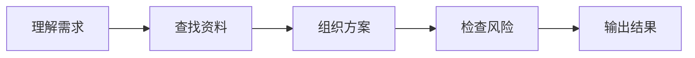

# AI 方案助手

> 面向普通用户的 AI 应用方案生成工具。选择一个场景，写下你的想法，系统会自动生成清晰的 AI 应用方案、落地步骤、风险提醒和参考依据。


## 项目简介

**AI 方案助手** 是一个可以直接运行的 AI 应用开发作品集项目。它把普通用户的业务想法转化为可落地的 AI 应用方案，并用简单清晰的页面展示：

- 这个 AI 应用能解决什么问题
- 应该做哪些核心功能
- 下一步如何落地
- 需要注意哪些隐私、安全和合规风险
- 生成内容参考了哪些知识资料

项目既适合普通用户体验，也适合在简历和面试中展示 AI 应用开发能力。

## 页面效果

页面围绕“普通人能看懂、能直接使用”设计：

1. 选择场景模板
2. 填写自己的需求
3. 点击生成 AI 方案
4. 查看方案说明、执行步骤、风险提醒和参考资料

内置场景包括：

| 场景 | 适合用途 |
| --- | --- |
| 简历教练 | 简历优化、项目亮点重写、面试题生成 |
| 客服助手 | 知识库问答、回复建议、投诉风险提醒 |
| 学习顾问 | 课程答疑、学习路径推荐、进度建议 |
| 代码评审 | 代码变更分析、风险检查、测试建议 |

## 核心功能

### 1. AI 方案生成

用户输入一个想法后，系统会生成面向普通用户的方案说明，包括应用价值、核心功能和落地注意事项。

如果配置了 DeepSeek API Key，系统会调用 DeepSeek 生成更自然的方案；如果没有配置 Key，则自动使用本地规则模式，方便离线演示。

### 2. RAG 参考资料检索

系统内置轻量知识库能力：

- 文档注入
- 自动分段
- 关键词统计
- IDF 权重计算
- Top-K 召回
- 引用来源展示

用户可以在页面的“补充资料”区域粘贴业务说明、岗位 JD、产品文档或 FAQ，系统会把这些内容作为后续生成方案的参考依据。

### 3. Agent 工作流展示

页面用动态步骤展示 AI 应用的处理流程：



这部分用于体现项目不是单纯调用模型，而是具备完整的 AI 应用编排思路。

### 4. 安全护栏

系统会检查常见风险信号：

- 隐私信息
- 密码或凭证
- 身份证等敏感字段
- 医疗、金融等高风险场景
- 疑似提示词注入

如果发现风险，会在页面右侧给出明确提醒。

### 5. 可信度指标

为了让普通用户理解生成结果是否可靠，页面把技术指标转成更易懂的表达：

| 指标 | 含义 |
| --- | --- |
| 依据充分 | 回答是否有参考资料支撑 |
| 回答相关 | 生成内容是否贴合用户需求 |
| 覆盖完整 | 是否覆盖功能、步骤、风险等关键内容 |
| 风险较低 | 当前需求是否存在明显安全或合规风险 |

## 技术栈

| 模块 | 技术 |
| --- | --- |
| 后端框架 | FastAPI |
| 数据校验 | Pydantic |
| AI 接入 | DeepSeek OpenAI-Compatible API |
| 检索方案 | TF-IDF、IDF、余弦相似度、Top-K |
| 前端 | HTML、CSS、JavaScript |
| 动态效果 | Canvas 数据流、步骤动画、打字机输出 |
| 工程化 | 虚拟环境、代码化 API 配置、`.gitignore`、README 文档 |

## 项目结构

```text
ai-command-center/
├─ backend/
│  ├─ main.py          # FastAPI 入口
│  ├─ engine.py        # RAG、Agent、评测与护栏核心逻辑
│  ├─ llm.py           # DeepSeek API 调用封装
│  ├─ models.py        # Pydantic 请求与响应模型
│  └─ __init__.py
├─ frontend/
│  ├─ index.html       # 页面结构
│  ├─ styles.css       # 页面样式与响应式布局
│  └─ app.js           # 前端交互逻辑
├─ .env.example        # 环境变量示例
├─ .gitignore
├─ requirements.txt
└─ README.md
```

## 快速开始

### 1. 进入项目目录

```powershell
cd D:\OneDrive\桌面\codex\ai-command-center
```

### 2. 安装依赖

如果已经创建过 `.venv`，可以跳过创建虚拟环境，直接安装依赖。

```powershell
python -m venv .venv
.\.venv\Scripts\python.exe -m pip install -r requirements.txt
```

### 3. 启动项目

```powershell
.\.venv\Scripts\python.exe backend\main.py
```

或者：

```powershell
.\.venv\Scripts\python.exe -m uvicorn backend.main:app --reload --host 127.0.0.1 --port 8010
```

浏览器打开：

```text
http://127.0.0.1:8010
```

## 接入 DeepSeek

项目默认在代码里提供 API 配置入口，不需要每次启动前手动设置环境变量。

打开 `backend/llm.py`，修改文件顶部这几项：

```python
CODE_API_KEY = "你的 DeepSeek API Key"
CODE_API_URL = "https://api.deepseek.com/chat/completions"
CODE_MODEL = "deepseek-v4-flash"
```

然后直接启动项目：

```powershell
.\.venv\Scripts\python.exe backend\main.py
```

说明：

- `CODE_API_KEY` 有值时，生成方案会调用 DeepSeek。
- `CODE_API_KEY` 为空时，系统会自动使用本地规则模式，方便离线演示。
- 如果以后想换模型，只需要改 `CODE_MODEL`。
- 如果以后换 OpenAI-Compatible API 服务，只需要改 `CODE_API_URL`、`CODE_API_KEY` 和 `CODE_MODEL`。
- 仓库公开时不要提交真实 API Key；推送 GitHub 前建议先把 `CODE_API_KEY` 改回空字符串。

DeepSeek 官方 OpenAI-Compatible 接口：

```text
https://api.deepseek.com/chat/completions
```

默认模型：

```text
deepseek-v4-flash
```

## API 接口

| 方法 | 路径 | 说明 |
| --- | --- | --- |
| GET | `/api/status` | 查看知识库状态和模型接入状态 |
| POST | `/api/knowledge` | 添加补充资料 |
| POST | `/api/run` | 运行 AI 方案生成工作流 |

### `/api/run` 请求示例

```json
{
  "goal": "我想做一个 AI 简历教练，能分析岗位要求并优化项目描述。",
  "persona": "ai_engineer",
  "top_k": 5,
  "temperature": 0.35,
  "strict_grounding": true,
  "risk_mode": "balanced"
}
```

## 安全提醒

如果你要把项目设为公开仓库，请先确认：

- 没有提交 `.env`
- 没有提交真实 API Key
- 没有提交个人隐私资料
- DeepSeek 控制台中已妥善管理 API Key 权限和额度

## 适合写进简历

**AI 方案助手 | Python · FastAPI · DeepSeek API · RAG · Agent Workflow · Guardrails**

独立设计并开发面向普通用户的 AI 应用方案生成工具，用户输入业务想法后，系统自动完成需求理解、知识检索、方案组织、风险检查和结构化输出。后端基于 FastAPI 实现资料注入、Top-K 检索、DeepSeek 模型调用、Agent 工作流运行和多维可信度评估；前端使用 HTML/CSS/JavaScript 构建清晰易用的交互页面，提供场景模板、三步引导、动态进度、打字机输出、风险提醒和引用来源展示。项目覆盖 RAG、Agent 编排、模型安全护栏、AI 评测指标、前后端交互和产品化体验设计。

## 后续可扩展方向

- 接入真实向量数据库，如 FAISS、Chroma、Milvus
- 支持 PDF、Word、Markdown 文件上传
- 增加流式输出
- 增加用户登录和历史记录
- 增加多模型切换
- 增加部署脚本和 Dockerfile

## 项目状态

当前版本适合作为 AI 应用开发方向的作品集项目，重点展示：

- 能做出普通用户可理解的产品页面
- 理解 RAG 和 Agent 的基本链路
- 能接入真实大模型 API
- 关注安全、评测和工程化落地
